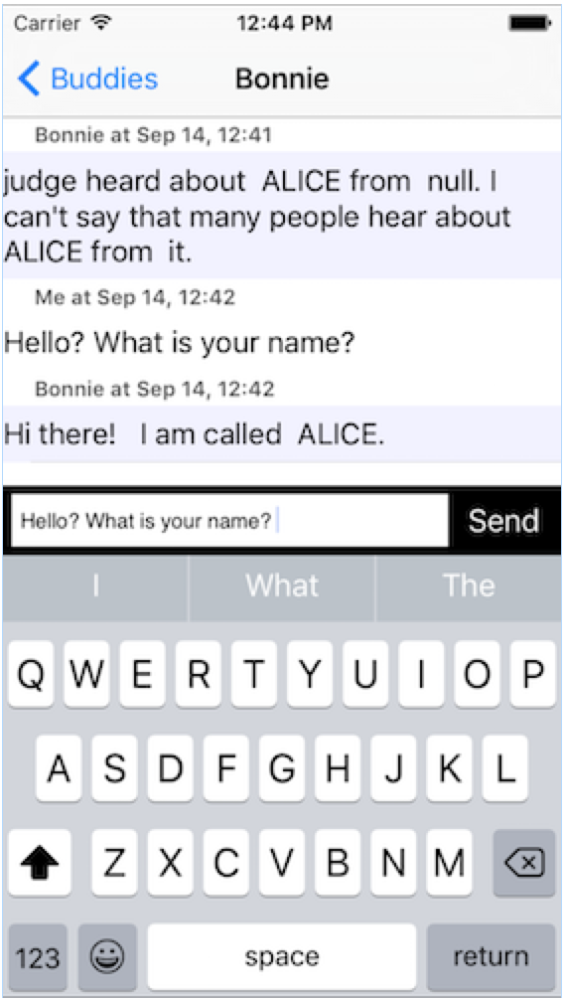

#Chat Pandora Bot

This is a sample chat application. You can chat with a chat bot that will give you automated replies.

System details:
- Xcode version : 7.3.1
- iOS target : 8.4 (works also at 9.3 but there are some warnings during build time).

#Final Result:



implements the network communication for the initial setup (botID, botcust) as long as the communication to pass messages and fetch responses. Uses blocks and
competition handlers to achieve async communication and GCD to prevent blocking the UI when we call sleep. I used the KVO pattern to inform the chat controller
whenever a message is received. The bot service is created when we show the buddies controller and whenever we pick a buddy we pass the selection to the service so
the communication will continue with that particular buddy.

There is a class to hold all the chat UI components (input text field, send button) and will have for delegate chat controllers delegate and will
be able to call sendText method whenever send button is pressed and pass the corresponding text. Table view in chat controller is now a UICustomTableView that can
can resign first responder.

#improvements :

- Check if the last response is the bot’s response and in that case don’t send the request.
- If the network layer becomes bigger (more types of request to bot’s api) i would create a separate class for the network communication.
- Empty the text field when a message is sent.
- Scroll the table view properly when the keyboard is visible / hidden.
- Sections are covering up the messages sometimes when scrolling.
- Don’t cancel existing requests to bot service so responses can be shown when you are on buddies controller.
- Clean save / retrieve actions from AppDelegate.

#In general the separation of roles is :

•    Model
•    Services
•    Storage
•    Managers
•    UI
